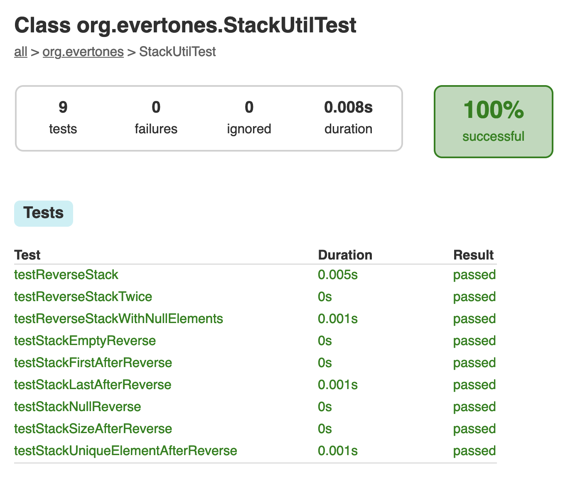

### Overview

This is a simple algorithm that reverses a stack.

### Run Tests

To run tests, please run Gradle with the following command (inside the project's folder):
```
./gradlew test
```

The program should run without errors and the output should print the message `BUILD SUCCESSFUL`.
A report is generated under the following path:
```
<project_folder>/app/build/reports/tests/test/classes/org.evertones.StackUtilTest.html
```

The report should be similar to the image below:
